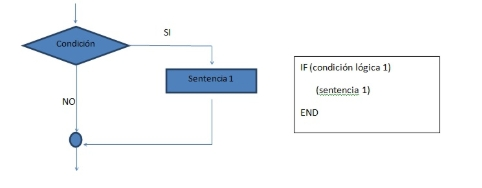
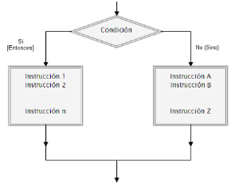
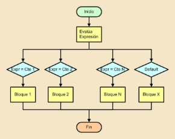
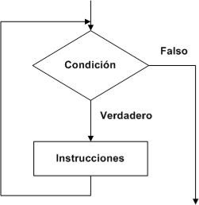
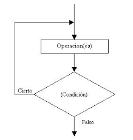
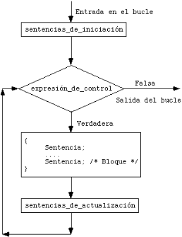

                                                          

*Programación		                                   Tema 3. Sentencias de Control de Flujo*

# Sentencias de Control de Flujo

[1.	Introducción	1](#_toc113270628)

[2.	Sentencias Condicionales.	2](#_toc113270629)

[3.	Sentencia de Selección Múltiple. switch case	5](#_toc113270630)

[4.	Sentencias de Repetición con Condición. while y do … while.	8](#_toc113270631)

[5.	Sentencia de Repetición con Contador. Sentencia for.	10](#_toc113270632)

1. # **Introducción**
   `	`El orden en que se ejecutan las distintas instrucciones de un programa se denomina *flujo de control*. 

   `	`Los programas que hemos visto en el tema anterior presentaban un flujo de control **secuencial**, es decir, las instrucciones se ejecutaban siempre una detrás de otra en el orden en el que aparecían en los subprogramas. Este orden secuencial nos limita el abanico de problemas que podemos resolver.

   `	`En muchas ocasiones se presenta la necesidad que un grupo de sentencias se ejecuten repetidamente. Otra situación es la necesidad de ejecutar o no un grupo de instrucciones en función de que se cumpla o no una determinada condición.

   `	`Las *estructuras de control* o *sentencias de control de flujo* permiten hacer esto. Se pueden agrupar en dos clases: estructuras de selección o condicionales y estructuras de repetición

   `	`Antes de pasar a estudiar las sentencias de control de flujo recordemos las **expresiones condicionales**.

   `	`Las expresiones condicionales son aquellas se evalúan a **true** o **false**. 

   Para escribir una expresión condicional podemos utilizar operadores aritméticos (+, -, \*, /, %), de comparación (<, >, <=, >=, !=, ==) y lógicos (!, ||, &&) y **el resultado debe ser un valor Lógico o Booleano**. 
   **

1. # **Sentencias Condicionales.** 
   La sentencia *if* (si en inglés) responde al concepto algorítmico de sentencia de bifurcación condicional y permite ejecutar una sentencia en función del valor de una determinada condición lógica sobre las variables del programa.

   `	`Es decir, la sentencia *if* permite ejecutar una sentencia si una condición resulta *cierta* u otra sentencia si la condición resulta *falsa*.

   **if ()** 

   En la sentencia *if()* si al evaluar la expresión lógica el resultado es **true**, se ejecuta la sentencia o sentencias que pertenezcan al if, si es **false** no se ejecuta nada y se pasa a la siguiente sentencia posterior a la sentencia *if*.

   

   La sintaxis de la sentencia if es la siguiente:

   **if** (condición)

   `	`Sentencia

   o bien 

   if (condición)

   {

   `	`Sentencias (si tenemos más de una sentencia)

   }

   Se debe evitar en la medida de lo posible omitir las llaves, incluso en aquellos bloques que encierran una única sentencia para así seguir las reglas de estilo.

   Ejemplo para calcular la comisión de ventas de un empleado:

   `       `if (ventas > 10000)

   `   `{

   comision = 0.10 \* ventas;

   `   `}

   Si queremos tener más de una sentencia dentro del if necesitamos poner las llaves {} obligatoriamente ya que si no lo hacemos sólo se ejecutará la sentencia que haya a continuación de la sentencia if.

   `    `if (ventas > 10000)

   `    `{

   `        `comision = 0.10 \* ventas;

   `        `MessageBox.Show("La comisión por ventas es " + comision.ToString());

   `    `}

- **if ()  else**

Las instrucciones **if () else** son una extensión del concepto **if()** 

Utilizando un bloque **if () else**, podemos definir dos bloques de código y que nuestro programa ejecute uno u otro dependiendo del resultado de una condición.

La sintaxis para utilizar una instrucción **if () else** es:

**if (condicion)**

**{**

`	`**Sentencias parte if**

**}** 

**else**

**{**

`	`**Sentencias parte else**

**}**

Ejemplo que calcula la raíz cuadrada de un número.

double numero, raiz;

numero = double.Parse(txtNum1.Text);

if (numero >= 0)

{

`    `raiz = Math.Sqrt(numero);

`    `MessageBox.Show("Raíz cuadrada de " + numero.ToString() + " es " + raiz.ToString());

}

else

{

`   `MessageBox.Show("No se puede calcular la raíz de un número negativo.");

}

MessageBox.Show("Fin del cálculo.");

**Anidamiento de sentencias if.**

`	`La sentencia o sentencias dentro de un if o else pueden ser cualquiera incluso a su vez otra sentencia if, lo que nos lleva al anidamiento de sentencias condicionales.

Ejemplo:

`	     `if (ventas > 10000)

`                `if (tipoEmpleado == 1)

`                    `comision = 0.1 \* ventas;

`                `else

`                    `comision = 0.08 \* ventas;

`            `else

`                `comision = 0;

` `En este tipo de sentencias anidadas se utilizan las llaves, aunque no sea necesario, para aclarar código y que sea más fácil de entender y para seguir las normas de estilo de C#:

`            `if (ventas > 10000)

`            `{

`                `if (tipoEmpleado == 1)

`                `{

`                   `comision = 0.1 \* ventas;

`                `}

`                `else

`                `{

`                    `comision = 0.08 \* ventas;

`                `}

`            `}

`            `else

`            `{

`                `comision = 0;

`            `}

Otro ejemplo con ifs anidados. 

`            `if (ventas > 10000)

`                    `comision = 0.1 \* ventas;

`            `else if (ventas > 5000)

`                    `comision = 0.05 \* ventas;

`                `else

`                    `comision = 0.02 \* ventas;

Para aclarar código y que sea más fácil de entender y para seguir las normas de estilo de C# deberíamos incluir las llaves.
#
1. # **Sentencia de Selección Múltiple. switch case**
   `	`La sentencia de selección múltiple ***switch case*** permite seleccionar y ejecutar una sentencia entre un conjunto de sentencias alternativas, según el valor de una determinada expresión

   

   `	`La sintaxis general de una sentencia *switch case* será:

   `            `switch (expresion)

   `            `{ 

   `                `case exp1:

   `                    `Sentencias 1;

   `                    `break;

   `                `case exp2:

   `                    `Sentencias 2;

   `                    `break;

   `                `case exp3:

   `                    `Sentencias 3;

   `                    `break;

                       ...

   `                `default:

   `                    `Sentencias default;

   `                    `break;

   `            `}

	

   `	`Nos permite ejecutar una alternativa en función del valor que tome *expresión*. Dicha expresión debe ser de tipo escalar (entero, carácter, string), exceptuando el tipo real.

   `	`Si al evaluar la expresión, esta toma un valor que coincide con alguna de las constantes o etiquetas (exp1, exp2, …) que hay a continuación, se ejecutará la sentencia (o sentencia compuesta) asociada a la misma.

   `	`Las etiquetas deben ser del mismo tipo que la expresión de selección. Podemos poner varias etiquetas asociadas a una misma sentencia.

   `	`Ejemplo para calcular la comisión para una venta en función del tipo de empleado:

   `            `switch (tipoEmpleado)

   `            `{ 

   `                `case 1:

   `                    `comision = 0.15 \* ventas;

   `                    `break;

   `                `case 2:

   `                    `comision = 0.1 \* ventas;

   `                    `break;

   `                `case 3:

   `                `case 4:

   `                `case 5:

   `                    `comision = 0.05 \* ventas;

   `                    `break;

   `                `default:

   `                    `comision = 0;

   `                    `break;

   `            `}

   `	`El **default que aparece como última opción de la sentencia switch** nos permite ejecutar una sentencia en el caso que el valor que se le dé a *expresion* no coincida con ninguna de las etiquetas consideradas. Es optativo.

	

   `	`Importante no olvidar la sentencia **break** dentro de cada uno de los apartados case. Si la olvidamos el programa seguiría ejecutando por las siguientes sentencias case. Por suerte, el compilador nos avisa con un error de sintaxis.

   `	`Por ejemplo, si en el código anterior olvidáramos el break de:

   `                `case 3:

   `                `case 4:

   `                `case 5:

   `                    `comision = 0.05 \* ventas;

   `                `default:

   `                    `comision = 0;

   `	`si el tipo de empleado fuera 3, 4 o 5 la comisión sería 0 porque al no estar el break seguiría por la etiqueta default. Realmente lo que pasa es que el compilador nos da un aviso que falta break en esa etiqueta.
   # **
1. # **Sentencias de Repetición con Condición. while y do … while.**
   Las instrucciones **de repetición con condición while y do…while** proporcionan un modo para que nuestra aplicación ejecute un bloque de código **mientras una condición sea verdadera.** Podemos utilizar estas instrucciones cuando conocemos la condición que determina cuando debe detenerse la ejecución de nuestro código.

   Con las sentencias while y do…while, ordenamos a nuestro programa que haga algo **mientras que una condición sea verdadera**. La diferencia entre una instrucción while y do…while es si la condición es evaluada al principio o al final del bucle. 

   Las estructuras de control que evalúan expresiones al principio de un bucle (while) pueden no ser ejecutadas, dependiendo del valor inicial de la expresión.

   Las estructuras de control que evalúan expresiones al final de un bucle (do…while) aseguran que el código del bucle se ejecuta **al menos una vez**. 

   La sintaxis para la instrucción while es la siguiente:

   `	`while (condición)

   `	`{

   `		`Sentencias;

}

Por otro lado, la sintaxis para la sentencia do…while sería la siguiente:

do{

`		`Sentencias;

} while (condición);

A continuación, mostramos un ejemplo en el que se introduce un número y se muestran por pantalla los números del 1 a ese número:

`            `int i, num;

`            `num = int.Parse(txtNum.Text);

`            `i = 1;

`            `while (i <= num)

`            `{

`                `MessageBox.Show("Valor: " + i);

`                `i++;

`            `}

`	`El mismo problema, pero ahora con un do … while:

`            `int i, num;

`            `num = int.Parse(txtNum.Text);

`            `i = 1;

`            `do

`            `{

`                `MessageBox.Show("Valor: " + i);

`                `i++;

`            `} while (i <= num);
#
1. # **Sentencia de Repetición con Contador. Sentencia for.**
   La sentencia *for* permite repetir la ejecución de una sentencia **un número determinado de veces**, que debe ser conocido de antemano.

   `	`Un bucle *for* se ejecuta un determinado número de veces fijado por un contador de bucles. 

   `	`La sintaxis de la sentencia *for*:

   `		`for(inicialización; condición; incremento)

   `		`{

   `			`Sentencias;

   `		`}

   `	`Dentro del paréntesis aparecen tres partes:

- inicialización: Aquí inicializaremos la variable contador que nos permitirá ejecutar repetidamente el bucle.
- condición: Habrá una condición lógica. Mientras la condición sea cierta se ejecutará el bucle.
- incremento: Aquí se hará el incremento de la variable contador.

  

El ejemplo siguiente nos muestra por pantalla los números que van del 1 al 10:

`            `const int Numero = 10;

`            `for (int i = 1; i <= Numero; i++)

`                `MessageBox.Show("Valor: " + i);

`	`El ejemplo anterior:

1. Se inicializa la variable i con el valor 1.
1. Mientras se cumpla la condición i <= NUMERO se ejecutan repetidas veces las sentencias de dentro del for.
1. i++. En cada paso del bucle se incrementa en 1 el valor de i.

El siguiente ejemplo nos muestra por pantalla**, en un solo messagebox**, los números **pares del 1 al 10**:

`            `const int Numero = 10;

`            `int i;

`            `string texto;

`            `texto = "Numeros pares: ";

`            `for (i = 2; i <= Numero; i = i + 2)

`                `texto = texto + i + ", ";

`            `MessageBox.Show(texto);

`	`Por último, vamos a mostrar por pantalla los números de 10 al 1:

`            `const int Numero = 10;

`            `int i;

`            `string texto;

`            `texto = "Numeros del 10 al 1: ";

`            `for (i = Numero; i >= 1; i--)

`                `texto = texto + i + ", ";

`            `MessageBox.Show(texto);

`	`Atención al for de este último ejemplo: 

- La inicialización se hace con i = Numero ya que queremos empezar en 10.
- La condición ahora es i >= 1, ya que mientras i sea mayor o igual que 1 vamos a seguir en el bucle.
- Por último, el incremento ahora es realmente un decremento i--, ya que lo que hacemos es restar 1 en cada vuelta a la variable i.
*David González del Arco			Página 1**
